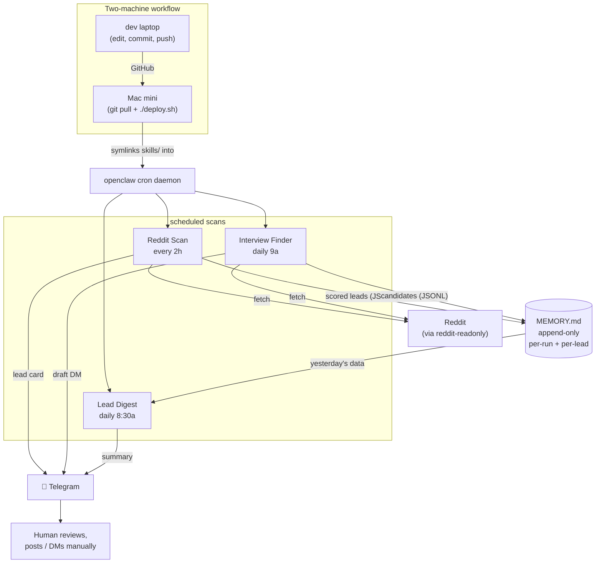

# vabene-agents

> A small fleet of LLM agents that scout Reddit for VaBene's customer-development pipeline. Source-of-truth repo for skills, prompts, and operational discipline.

## What this is

Four [openclaw](https://github.com/openclaw/openclaw) skills running on a 24/7 Mac mini, scanning Reddit every two hours for celebration-planning conversations VaBene serves, plus a daily JTBD interview-recruitment loop that surfaces qualified research candidates and tracks outreach state. Drafts go to Telegram for manual review — nothing posts to Reddit automatically.

VaBene is a marketplace for self-host birthday/celebration planning, currently in pre-launch in San Francisco. The agents exist to compress the founder's time at the top of the funnel: turning passive Reddit lurking ("are people asking for what I'm building?") into a structured, version-controlled signal pipeline.

> **Hero visual TODO** — drop a screenshot here of (a) the Telegram lead-card format, (b) a sample Lead Digest, and (c) a `git log --oneline` showing the iteration cadence. Three small images side-by-side say more than the next 200 lines of this README.

## What's running

| Skill | Cadence | Role |
|---|---|---|
| `vabene-reddit-monitor` | every 2h, 8a–10p PT | Scan city + planning subs, score against a two-axis qualifier, draft a planner-pain-framed reply for each qualifying post |
| `vabene-interview-finder` | daily 9am PT | Find Reddit users actively in coordination pain → interview candidates; draft a personalized 20-min outreach DM |
| `vabene-discovery-synthesis` | manual / weekly aggregate | Two-phase JTBD synthesis (AI draft → human refine) over interview transcripts; produces candidate opportunities for an Opportunity Solution Tree |
| `vabene-interview-recruiter` | manual / daily sweep | Closes the loop between `interview-finder` and `discovery-synthesis`: drafts personalized invites, tracks outreach state via Telegram replies, surfaces stalled threads |
| `prompts/lead-digest.md` | daily 8:30am PT | One-shot inline prompt summarizing yesterday's monitoring (no skill — just a cron payload) |

## Tech stack

- **openclaw** — sandboxed agent runtime + cron daemon (LaunchDaemon on macOS)
- **Anthropic Claude API** — Haiku 4.5 for high-frequency scans, Sonnet 4.6 for synthesis
- **`reddit-readonly`** — sibling skill (openclaw-shipped, deliberately not vendored — see "Decisions" below)
- **Telegram Bot API** — sole delivery channel; review-only, no automatic posting
- **JSONL on disk** — append-only `MEMORY.md`; queried with `jq`. No database.
- **GitHub** for source-of-truth, **Tailscale** for dev↔host transport

## Architecture



The "two machines" pattern is the structural decision the rest of the repo follows: `dev laptop` is the only machine that produces commits, the `mac mini` is a pure consumer (`git pull && ./deploy.sh`). See [`deploy/README.md`](deploy/README.md) for host bootstrap, [`deploy.sh`](deploy.sh) for the symlink mechanic.

## Getting started

This repo deploys to an existing openclaw installation. To stand it up on a new host (e.g. a fresh DigitalOcean droplet), the full bootstrap is documented in [`deploy/README.md`](deploy/README.md). The 60-second version:

```bash
# On the host:
git clone git@github.com:benjaminematton/vabene-agents.git ~/Developer/vabene-agents
cd ~/Developer/vabene-agents
./deploy.sh                         # symlinks skills/ into ~/.openclaw/skills/
openclaw cron list                  # verify daemon picked them up
```

To make a behavior change to a skill:

```bash
# On the dev laptop:
$EDITOR skills/vabene-reddit-monitor/SKILL.md
git commit -am "fix(reddit-monitor): tighter wedding-day exclusions"
git push

# On the host (or any consumer):
cd ~/Developer/vabene-agents && git pull && ./deploy.sh
# next cron tick uses the new version — no daemon restart needed
```

Iteration cadence (when to tune, what knobs in what order, how to roll back) is documented in [`TUNING.md`](TUNING.md). Per-skill rationale and change logs live in each `skills/<name>/README.md`.

## Decisions & tradeoffs

The five non-obvious calls. Each could have gone the other way; the ones that stuck have receipts in the commit history.

### 1. Two-machine, single source of truth

Considered: let either machine produce commits. Picked: dev laptop is the only commit-producer; the host is a pure consumer (`git pull && ./deploy.sh`).

The trade-off is one extra SSH hop per change. The win is zero divergence between repo and host, no GitHub auth on the host, and a clean migration path to a future droplet. When I bootstrapped the repo, the host already had eight months of `nano`-edited skill files; importing them as commit #2 (`chore: import live skills from openclaw host`) before any rewrite preserved the diff history of the actual rewrite as commit #4. Without the discipline of commit-from-dev-only, that history collapses into "everything happened on Tuesday."

### 2. City-sub-first scan architecture (the v2.0.0 inversion)

The first version of `vabene-reddit-monitor` led with planning-specific subs: r/Bachelorette, r/BachelorettePlanning, r/MaidOfHonor, r/GirlsTrip, r/birthdays, r/weddingplanning. Two days of data revealed that Reddit had banned r/MaidOfHonor and r/GirlsTrip outright, and r/Bachelorette is the TV show — recent posts are Gabby Windey gossip, not bach-party planning.

The fix wasn't "drop those subs" — that's a one-line patch. The fix was inverting the architecture: city subs (r/SanFrancisco, r/AskSF, r/bayarea, plus LA/Vegas/Nashville on alternating ticks) became Tier 1, and the working planning subs got demoted to Tier 3. The actual lead source turned out to be "I'm turning 30 in SF, 8 of us, looking for ideas" in r/AskSF — not pain-venting in a banned planning sub. Trade-off: city subs have higher noise (restaurant questions, neighborhood-safety threads), so I added hard-exclusion keywords pre-scoring and a two-axis qualifier. Documented as a `feat!:` breaking change with a `BREAKING CHANGE:` footer so the version history reads honestly.

### 3. Two-axis numeric scoring instead of HIGH/MED/LOW labels

Considered: keep the simple priority-label system (HIGH/MED/LOW per event type) the v1 skill used. Picked: additive numeric scoring with derived tiers (HIGH ≥ 4, MED 2–3, excluded < 2).

The numeric form gives you one real knob — the HIGH score floor — instead of debating whether "milestone birthday" should be HIGH or MED in the abstract. It also makes the qualifier introspectable: every lead's score breakdown lands in MEMORY.md as JSONL, so when a lead surfaces that I wouldn't have replied to, I can see *exactly* which axes hit. The trade-off is intentional looseness: a celebration trigger + group size + SF locale = score 4 = HIGH without explicit pain language. That's a real lead ("turning 30 in SF, 8 of us…"), but it means strict two-axis HIGH-only behavior requires raising the floor from 4 to 5 — a single knob, documented as the primary tuning lever in [`TUNING.md`](TUNING.md).

### 4. The agents do not self-tune

Considered: build a feedback loop where lead quality judgments feed back into keyword weights or score thresholds. Picked: every behavior change is a human-authored commit. Skills don't modify their own SKILL.md based on their own runs.

The reasoning is operational, not philosophical. Self-modifying skills are hard to reason about, hard to roll back, and erode the trust signal of "this version of the skill produced these leads." The cost is a forcing function: I have to actually pay attention. The mitigation is [`TUNING.md`](TUNING.md), which encodes a cadence (silence for the first 14 days after a major change; deliberate review at day 14; trigger-driven thereafter) and a rollback playbook (`git revert <hash> && ssh host && git pull && ./deploy.sh`). The Lead Digest cron also acts as a daily forcing function — a one-paragraph automated summary of the previous day's MEMORY.md, delivered to Telegram every morning.

### 5. Killed `vabene-merchant-scout` before it shipped

The original v1 plan included a Reddit-based scout for SF private-event venues — supply-side discovery to pair with the demand-side Reddit monitor. Two days of research revealed that the SF private-events supply chain is aggregated under TripleSeat / Perfect Venue / EventUp / Partyslate / Tock — not Reddit. A Reddit-based merchant scout would be hunting an empty room.

The replacement was a roadmap entry for a partnership-monitoring agent (page-diff watching of those four platforms for new integrations / pricing changes), plus a manual one-time BD email push to those companies' partnership teams. The manual email is a Tuesday afternoon, not an agent. Rule learned: **don't build agents for problems where the data isn't where the agent looks**. This now sits at the top of the v3 plan as a check before any new skill spec.

## Roadmap

Skills marked "deployed but not yet wired to a cron" are running in manual-only mode until they accumulate three successful manual runs apiece — same rollout discipline `vabene-reddit-monitor` followed.

Deferred (named in the v2 plan but not yet specced):

- **Partnership-monitoring agent** — the actual supply-side leverage, replacing the killed `merchant-scout`
- **Multi-source feedback river** — Yelp / G2 / Trustpilot / Instagram, beyond Reddit
- **AI-moderated screener bot** — 5-min adaptive interview to pre-qualify ICP fit before sync time
- **Competitor product-watch** — Crayon-style page-diff of competitor pricing/feature pages
- **Demand-side smoke-test agent** — generates landing-page variants from synthesized job statements, runs them as ads, reports CTR/CVR

Each of those gets a dedicated plan when its turn comes, not a paragraph here.

## Repository layout

```
vabene-agents/
├── README.md                 ← you are here
├── TUNING.md                 ← iteration cadence + rollback playbook
├── deploy.sh                 ← idempotent symlink installer (runs on host)
├── sync-from-host.sh         ← snapshots host's jobs.json into the repo, sanitized
├── skills/
│   ├── README.md                              ← skill convention
│   ├── _TEMPLATE_README.md                    ← per-skill README template
│   ├── vabene-reddit-monitor/{SKILL,README}.md
│   ├── vabene-interview-finder/{SKILL,README}.md
│   ├── vabene-discovery-synthesis/{SKILL,README}.md
│   └── vabene-interview-recruiter/{SKILL,README}.md
├── prompts/lead-digest.md    ← inline prompt for the Lead Digest cron
├── crons/jobs.example.json   ← sanitized snapshot of the cron config
├── deploy/README.md          ← host bootstrap checklist (Tailscale, LaunchDaemon)
└── memory/                   ← (gitignored MEMORY.md lives on the host)
```

## Scope

This repo is **agent-infrastructure only**: skills, crons, prompts, agent-side rationale. Broader VaBene product strategy (positioning, the celebration-not-bachelorette wedge, the SF-self-host-celebrant ICP) lives in a separate repo and is referenced from there, not duplicated here. If a strategy decision is about how the product is positioned, it goes in the product repo. If it's about how an agent decides what to flag or skip, it goes here.

## Author

**Ben Matton** · benjaminematton@gmail.com · [github.com/benjaminematton](https://github.com/benjaminematton)

Building [VaBene](https://vabene.app) — a marketplace for self-host celebration planning, launching in SF.
